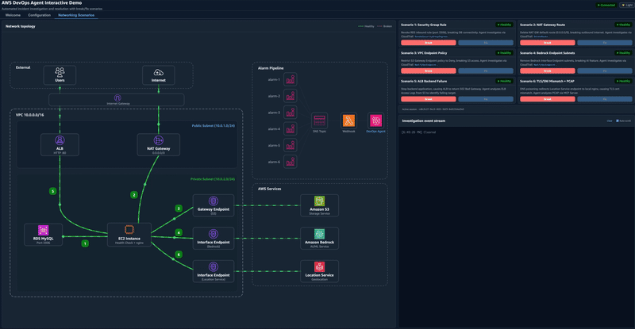
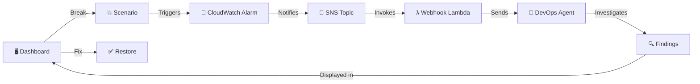

<p align="center">
  
</p>

<h1 align="center">AWS DevOps Agent Interactive Demo</h1>

<p align="center">
  <a href="LICENSE"></a>
  <a href="https://aws.amazon.com/cdk/"></a>
  <a href="https://docs.aws.amazon.com/devopsagent/latest/userguide/what-is.html"></a>
  <a href="#"></a>
  <a href="#"></a>
</p>

<p align="center">
  <strong>Break things on purpose. Watch AI investigate. Fix them in one click.</strong>
</p>

> **Note:** This is a demo application provided for learning and demonstration purposes only. It is not intended for production use.

<p align="center">
  
</p>

---

## Table of Contents

- [Overview](#overview)
- [Demo Video](#demo-video)
- [Architecture](#architecture)
- [Scenarios](#scenarios)
- [Prerequisites](#prerequisites)
- [Quick Start](#quick-start)
- [Dashboard Features](#dashboard-features)
- [PCAP MCP Server](#pcap-mcp-server)
- [Project Structure](#project-structure)
- [Cost Estimate](#cost-estimate)
- [Clean Up](#clean-up)
- [Security](#security)
- [Documentation](#documentation)
- [Contributing](#contributing)
- [License](#license)

---

## Overview

An interactive demo showcasing [AWS DevOps Agent](https://docs.aws.amazon.com/devopsagent/latest/userguide/what-is.html) automated incident investigation and resolution across 6 network break/fix scenarios.

Deploy a fully functional environment with a single command. Break things on purpose, watch DevOps Agent investigate using CloudTrail, VPC Flow Logs, ELB Access Logs, and PCAP analysis, then fix them.

### How it works



---

## Demo Video

https://github.com/user-attachments/assets/0f265e68-2cb7-4053-9308-86da53bd89f4

---

## Architecture

The demo deploys **9 CDK stacks** into your AWS account:

| Stack | Purpose |
|:------|:--------|
| 🌐 **NetworkStack** | VPC, subnets, NAT Gateway, VPC endpoints (S3, Bedrock, Location Service, CloudWatch, SSM, STS), flow logs |
| 💻 **ComputeStack** | EC2 instance (health checks + nginx), ALB, RDS MySQL, ELB access logs |
| 🔄 **TrafficGenStack** | Lambda + EventBridge schedule generating traffic to the ALB |
| 🚨 **AlarmStack** | 6 CloudWatch alarms, SNS topic, webhook Lambda, Secrets Manager |
| 🔐 **AuthStack** | Cognito User Pool, M2M app client, dashboard authentication |
| 📦 **PcapMcpStack** | PCAP storage S3 bucket, AgentCore execution IAM role |
| 🐳 **ImageStack** | ECR repository, CodeBuild project (builds PCAP MCP Server container + creates AgentCore Runtime) |
| 🤖 **DevOpsAgentStack** | Agent Space, IAM roles, account association |
| 📊 **DashboardStack** | S3 + CloudFront frontend, API Gateway, Lambda handlers, DynamoDB |

---

## Scenarios

| # | Scenario | Break Action | Primary Evidence |
|:-:|:---------|:-------------|:-----------------|
| 1 | **Security Group Rule** | Revoke RDS inbound rule (port 3306) | CloudTrail + VPC Flow Logs |
| 2 | **NAT Gateway Route** | Delete default route (0.0.0.0/0) | CloudTrail + VPC Flow Logs |
| 3 | **VPC Endpoint Policy** | Deny S3 Gateway Endpoint policy | CloudTrail |
| 4 | **Bedrock Endpoint Subnets** | Remove Interface Endpoint subnets | CloudTrail |
| 5 | **ALB Backend Failure** | Stop backend application (502 Bad Gateway) | ELB Access Logs |
| 6 | **TLS/SNI Mismatch + PCAP** | DNS poisoning of Location Service endpoint | PCAP MCP Server |

Each scenario triggers a real infrastructure change, a CloudWatch alarm fires, a webhook notifies DevOps Agent, and an automated investigation begins.

---

## Prerequisites

| Requirement | Version | Purpose |
|:------------|:--------|:--------|
| **Node.js** | 18+ | CDK and Lambda bundling |
| **npm** | — | Package management |
| **AWS CLI** | v2 | AWS credential management |
| **AWS CDK** | — | `npm install -g aws-cdk` or use `npx` |
| **AWS Account** | — | Permissions for VPC, EC2, RDS, Lambda, Cognito, Bedrock AgentCore |

---

## Quick Start

### 1. Clone and install

```bash
git clone https://github.com/aws-samples/sample-aws-devops-agent-interactive-demo.git
cd sample-aws-devops-agent-interactive-demo
npm install
```

### 2. Deploy

```bash
bash scripts/deploy.sh
```

The deploy script will:
- ✅ Check prerequisites (Node.js 18+, npm, AWS CLI)
- ✅ Bootstrap CDK if needed
- ✅ Deploy all 9 stacks (~15-20 minutes)
- ✅ Refresh downstream stacks for MCP endpoint resolution
- ✅ Display the dashboard URL, login credentials, and next steps

### 3. Configure DevOps Agent

After deployment, the script displays:
- **Dashboard URL** (CloudFront)
- **Login credentials** (auto-generated, stored in Secrets Manager)
- **Agent Space console link**

Log into the dashboard and go to the **Configuration** tab:

1. **Register the MCP Server** in the Agent Space console using the endpoint URL and OAuth credentials shown on the dashboard
2. **Configure the Webhook** by generating a webhook URL and HMAC secret in the Agent Space console, then pasting them into the dashboard
3. **Note the S3 bucket ARNs** displayed on the dashboard — the Agent Space IAM role has been pre-configured with `s3:GetObject` and `s3:ListBucket` permissions

### 4. Run scenarios

Go to the **Networking Scenarios** tab:

1. Click **Break** on any scenario to trigger a network failure
2. Watch the **Investigation event stream** as DevOps Agent investigates
3. Click the **DevOps Agent** link in the topology diagram to view the Operator Access dashboard
4. Click **Fix** to restore the infrastructure

> **Tip:** Only one scenario can be active at a time (mutual exclusion).

---

## Dashboard Features

| Feature | Description |
|:--------|:------------|
| 🗺️ **Network Topology** | Animated SVG diagram with traffic flows that turn red when a scenario breaks |
| 🚨 **Alarm Pipeline** | Visual flow from CloudWatch Alarm → SNS → Lambda → DevOps Agent |
| 📡 **Event Stream** | Real-time terminal showing break, alarm, webhook, investigation, and fix events |
| 📱 **Responsive Layout** | Adapts from 4K displays to laptops with fluid font scaling |
| 🌙 **Light/Dark Mode** | Toggle between themes |
| 🔒 **Webhook Gate** | Prevents running scenarios until the webhook is configured |
| 🔗 **Operator Dashboard** | Click the DevOps Agent icon to open the investigation dashboard |

---

## PCAP MCP Server

Scenario 6 uses a custom MCP server running on [Amazon Bedrock AgentCore Runtime](https://docs.aws.amazon.com/devopsagent/latest/userguide/configuring-capabilities-for-aws-devops-agent.html) for packet capture analysis. It wraps the upstream [sample-pcap-analyzer-mcp](https://github.com/aws-samples/sample-pcap-analyzer-mcp) with three enhancements:

| Enhancement | Details |
|:------------|:--------|
| **Transport** | FastMCP with streamable-http (AgentCore compatible) |
| **S3 Support** | Transparently downloads `s3://` URIs before analysis |
| **tshark Fix** | Overrides buggy upstream `summary` mode with valid tshark commands |

See [codebuild-scripts/README.md](codebuild-scripts/README.md) for the full technical deep-dive.

---

## Project Structure

```
.
├── 📁 bin/                    CDK app entry point
├── 📁 lib/                    9 CDK stack definitions
├── 📁 lambda/                 Lambda function handlers
│   ├── dashboard-break/       POST /break — triggers scenario failures
│   ├── dashboard-fix/         POST /fix — restores infrastructure
│   ├── dashboard-config/      GET /config — MCP/OAuth/bucket config
│   ├── dashboard-health/      GET /health — scenario status polling
│   ├── dashboard-events/      GET /events — event stream polling
│   ├── dashboard-eventbridge/  EventBridge rule handler
│   ├── dashboard-webhook-config/ POST /webhook-config
│   ├── webhook/               SNS → DevOps Agent webhook forwarder
│   ├── traffic-generator/     ALB traffic generation
│   ├── build-trigger/         CodeBuild trigger
│   └── build-waiter/          CodeBuild completion waiter
├── 📁 frontend/               Dashboard UI (HTML/CSS/JS)
│   ├── index.html             Main dashboard with SVG topology
│   ├── styles.css             Cloudscape-inspired design tokens
│   ├── app.js                 Dashboard logic and polling
│   └── icons/                 AWS service SVG icons
├── 📁 health-check-app/       EC2 health check application (Node.js)
├── 📁 codebuild-scripts/      PCAP MCP Server Docker build
├── 📁 scripts/                Deploy, destroy, show-outputs scripts
├── 📁 test/                   CDK stack tests
└── 📁 docs/                   Demo assets (GIF, images)
```

---

## Cost Estimate

This demo deploys real AWS resources that incur charges. Estimated costs for **us-east-1**:

| Resource | Spec | Cost/hour |
|:---------|:-----|----------:|
| NAT Gateway | 1x | $0.045 |
| VPC Interface Endpoints | 8x (2 ENIs each) | $0.160 |
| EC2 Instance | t3.medium | $0.042 |
| RDS MySQL | db.t3.micro, 20 GB | $0.017 |
| ALB | 1x | $0.023 |
| CloudFront, Lambda, DynamoDB, S3, Secrets Manager | — | ~$0.00 |
| **Total** | | **~$0.29/hr (~$6.90/day)** |

> 💡 **Quick demo (1-2 hours):** under $1 — **Overnight:** ~$7
>
> ⚠️ **Run `bash scripts/destroy.sh` when done to avoid ongoing charges.**

---

## Clean Up

```bash
bash scripts/destroy.sh
```

The destroy script retries up to 5 times to handle dependency ordering and eventual consistency.

---

## Security

- 🔐 All API Gateway endpoints protected by Cognito authentication
- 🎯 IAM policies scoped to specific resources
- 🔑 Secrets stored in AWS Secrets Manager
- 🛡️ IMDSv2 enforced on EC2 instances
- 🔒 RDS and EBS encryption enabled
- 🌐 CORS scoped to CloudFront distribution domain
- ✅ Security review completed with 0 open findings

---

## Documentation

- [What is AWS DevOps Agent](https://docs.aws.amazon.com/devopsagent/latest/userguide/what-is.html)
- [Getting Started Guide](https://docs.aws.amazon.com/devopsagent/latest/userguide/getting-started-with-aws-devops-agent.html)
- [Working with DevOps Agent](https://docs.aws.amazon.com/devopsagent/latest/userguide/working-with-devops-agent.html)
- [Configuring Capabilities](https://docs.aws.amazon.com/devopsagent/latest/userguide/configuring-capabilities-for-aws-devops-agent.html)
- [API Reference](https://docs.aws.amazon.com/devopsagent/latest/APIReference/Welcome.html)

---

## Contributing

We welcome contributions! See [CONTRIBUTING.md](CONTRIBUTING.md) for guidelines.

---

## License

This library is licensed under the MIT-0 License. See the [LICENSE](LICENSE) file.

---

<p align="center">
  Built with ❤️ using <a href="https://aws.amazon.com/cdk/">AWS CDK</a> and <a href="https://docs.aws.amazon.com/devopsagent/latest/userguide/what-is.html">AWS DevOps Agent</a>
</p>
